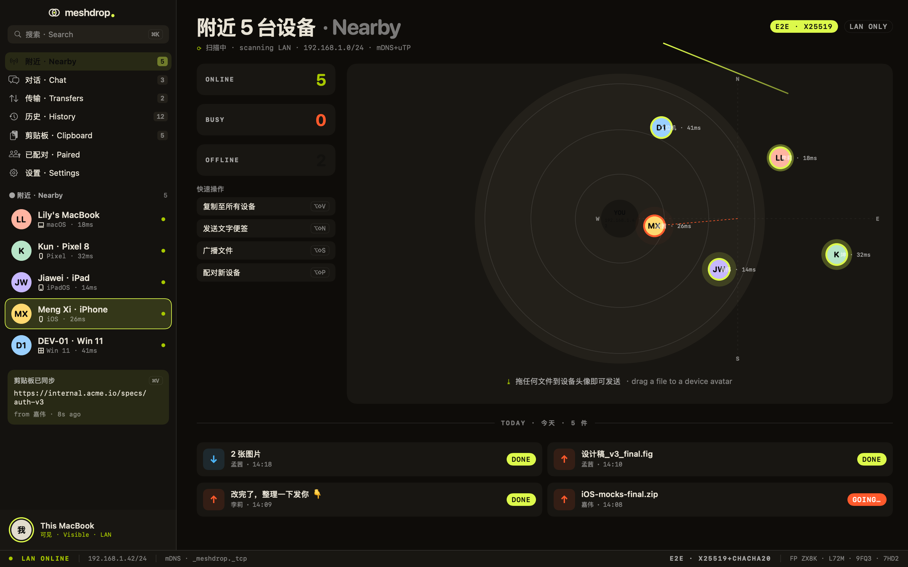
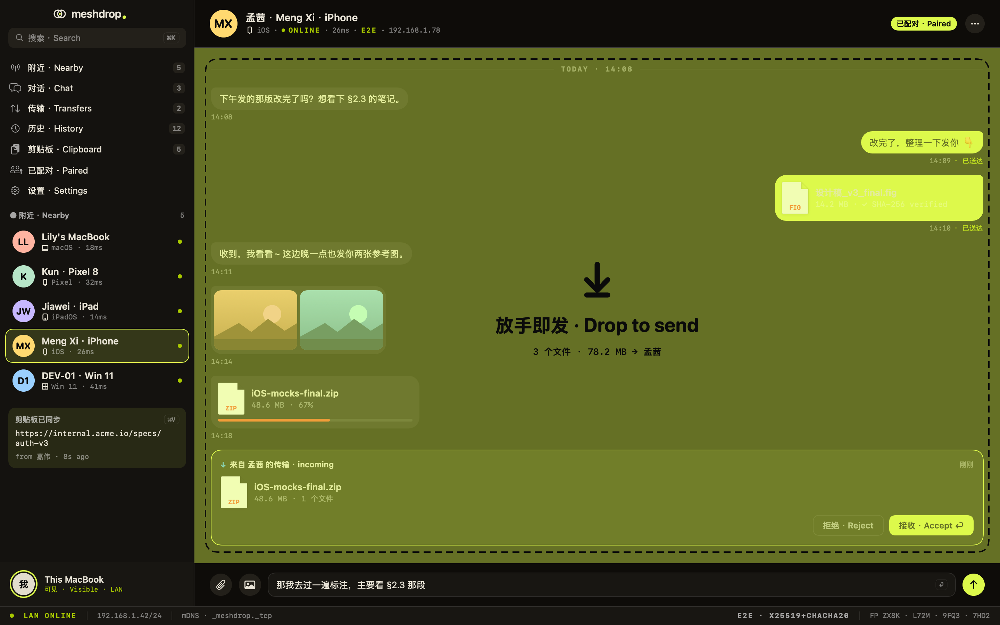
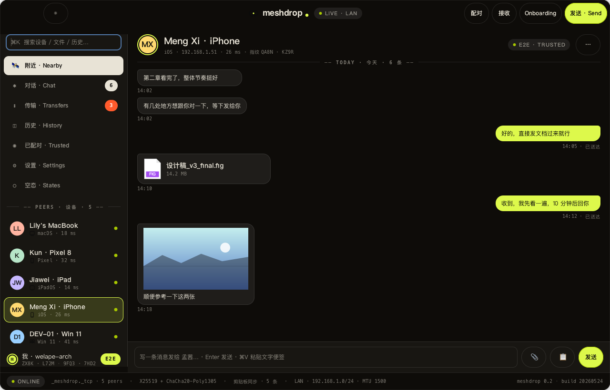
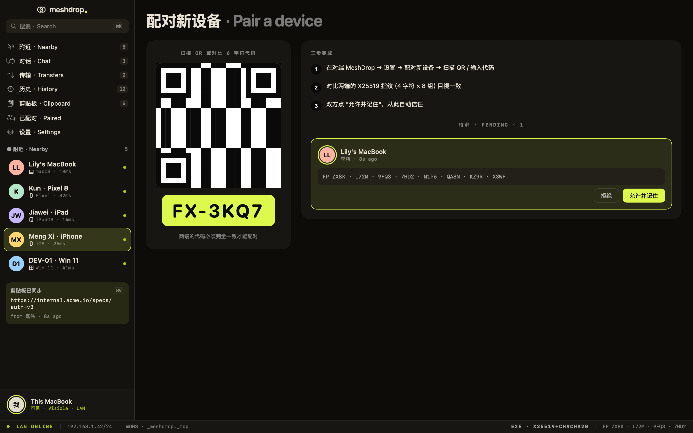
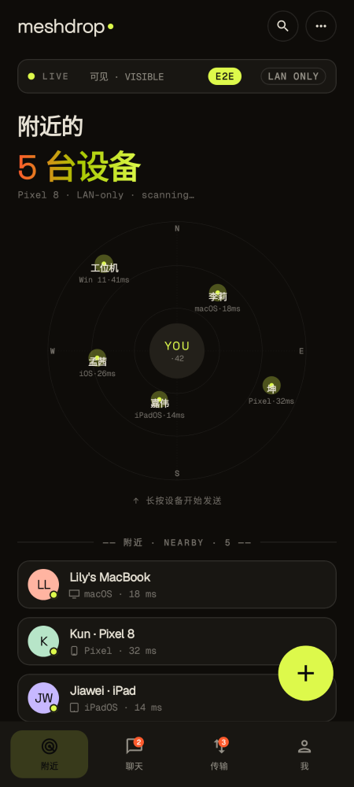
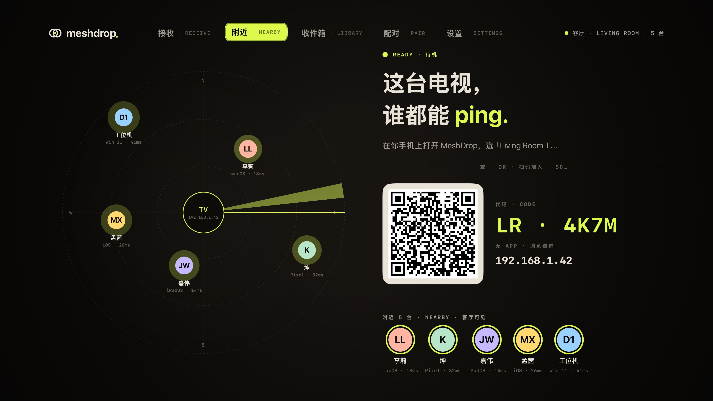

# MeshDrop

**人人可用的 AirDrop —— 跨平台、点对点的局域网文件与文本分享。**
同一网段内的设备自动互相发现，点选目标即可发送一段文字或一组文件。**所有端原生实现**
—— 不走 Electron / Flutter / React Native —— 保证最佳性能与平台体验。

[](https://apps.apple.com/cn/app/meshdrop/id6772689903)
[](LICENSE)


[English](README.md) · **简体中文**

---

## 截图

<table>
  <tr>
    <td align="center"><br><sub>macOS · 设备发现</sub></td>
    <td align="center"><br><sub>macOS · 拖拽发送</sub></td>
  </tr>
  <tr>
    <td align="center"><br><sub>Linux (GTK4) · 对话</sub></td>
    <td align="center"><br><sub>macOS · TOFU 配对</sub></td>
  </tr>
  <tr>
    <td align="center"><br><sub>Android</sub></td>
    <td align="center"><br><sub>tvOS（仅接收）</sub></td>
  </tr>
</table>

> 还有可穿戴端：Apple Watch 与 Wear OS 作为手机 App 的 companion
> （`screenshots/applewatch-nearby-dark.png`、`screenshots/wearos-nearby-dark.png`）。

## 功能

- **零配置、零服务器** —— mDNS / DNS-SD 发现 + 直连 TCP。无信令服务器、无云转发、
  无需账号、无需联网。
- **发送文字或文件** 给局域网内任意设备，完整的 offer / accept / reject / cancel 流程。
- **断点续传** —— 传输中断后从断点继续（`FILE_ACCEPT.resume_offset`）。
- **首次信任（TOFU）** —— 首次连接需确认对端指纹；已信任设备会被记住，类 SSH
  `known_hosts` 模型。
- **各端原生** —— SwiftUI、Jetpack Compose、WinUI 3、GTK4/ratatui、React，每端遵循
  平台 HIG。
- **浏览器接入** —— 桌面端内置 Web Gateway（TLS 1.3 自签证书），局域网内浏览器可加入。
- **可穿戴 companion** —— Apple Watch（WatchConnectivity）与 Wear OS（Wearable Data
  Layer）桥接到手机 App。
- **系统分享集成** —— iOS Share Extension 与 Android Share Target。

## 下载 / 安装

| 平台 | 获取方式 |
| --- | --- |
| **iOS / iPadOS / macOS / tvOS / visionOS / watchOS** | [**App Store**](https://apps.apple.com/cn/app/meshdrop/id6772689903)（1.0, build 2） |
| Android / Windows / Linux / Web | 从源码构建（预发布 `0.1.0`），见下方各端 README |

## 平台覆盖

| 平台 | 技术栈 | 状态 |
| --- | --- | --- |
| macOS | SwiftUI + Network.framework | 可构建 / MeshDropKit 测试通过 |
| iOS 17+ / iPadOS | SwiftUI + Network.framework | ✅ 已上架 App Store（1.0, build 2） |
| iOS 26 | + Liquid Glass (`.glassEffect()`) | UI 已接入 |
| tvOS | SwiftUI focus engine（只接收） | 与 Apple core 共用实现 |
| visionOS | SwiftUI spatial + glass | 已接 engine adapter（保留 preview mock） |
| watchOS | SwiftUI + WatchConnectivity 桥到 iPhone | companion bridge |
| Android | Jetpack Compose + `NsdManager` | build + 单元/截图测试 |
| Wear OS | Compose for Wear + Wearable Data Layer 桥到 Android | 可构建 |
| Windows | WinUI 3 (.NET 8) + `Makaretu.Dns` | .NET 8 + Windows App SDK 可构建 |
| Linux GUI | Rust + gtk4-rs + libadwaita + `mdns-sd` | core 测试 + GUI 构建 |
| Linux TUI | Rust + ratatui + `mdns-sd` | build/test 通过（10 个单测） |
| Web | React + Vite，通过 Gateway 桥接 | 可构建；仅显式 `?mock=1` 才进入 mock |

> **版本现状：** 只有 Apple 端（iOS / iPadOS / macOS / tvOS / visionOS / watchOS）已是
> `1.0.0`（build 2）并上架 App Store；Android / Wear OS / Linux / Web 仍是 `0.1.0`
> 预发布。
>
> **Bundle identifier 按平台各自命名，并非全局统一：** Apple = `com.welape.landrop`，
> Android = `com.welape.meshdrop`，Wear OS = `com.welape.meshdrop.wear`。

## 工作原理

各端实现同一份自研、语言无关的协议（见 [protocol/](protocol/README.md)）：

1. **发现** —— 通过 mDNS / DNS-SD 广播/浏览 `_meshdrop._tcp`。
2. **连接与握手** —— TCP framing + `HELLO` / `HELLO_ACK`，带版本协商。
3. **配对** —— 首次接触时接收端确认发送端指纹（TOFU）；之后已信任设备跳过。
4. **传输** —— `TEXT`，或 `FILE_OFFER → ACCEPT → CHUNK → COMPLETE`，带 SHA-256 校验与
   断点续传。

桌面端额外运行 Web Gateway（TLS 1.3 自签证书 + WebSocket 控制通道 + multipart 上传），
让局域网内浏览器加入（见 [protocol/companion-bridges.md](protocol/companion-bridges.md)）。

## 安全现状（v0.1）⚠️

在用于敏感数据前请务必阅读：

- v0.1 的 LAN 传输是**明文 TCP**。
- TOFU 指纹**只防误连，不抗主动 MITM**（`fp` 尚未与密钥/证书绑定）。
- Web Gateway 自身用 TLS 1.3（自签），但设备到设备的通道不加密。
- 端到端应用层加密在路线图中（v0.2 加入，v1.0 起强制）。

**不要把当前版本宣传或当作「端到端加密 / 安全传输」。** 详见
[protocol/security.md](protocol/security.md)。

## 从源码构建

每个平台子目录都有独立 README 说明依赖与步骤：

- [apple/README.md](apple/README.md) —— Swift Package `MeshDropKit` + Apple 各端。
  需 macOS + Xcode + [XcodeGen](https://github.com/yonaskolb/XcodeGen)（每个 target 跑
  `xcodegen generate`）。**仓库里的 `DEVELOPMENT_TEAM` 是原作者的 Apple team，fork 后必须
  改成你自己的** 才能签名/运行。
- [android/README.md](android/README.md) —— Gradle（AGP 8.13.2、Kotlin 2.4.0、JDK 17+；项目目标 Java 17）。
- [wearos/README.md](wearos/README.md) —— Wear OS（Gradle）。
- [windows/README.md](windows/README.md) —— .NET 8 + Windows App SDK（在 Windows 上构建）。
- [linux/README.md](linux/README.md) —— Cargo workspace（Rust + GTK4 + ratatui）。
- [web/README.md](web/README.md) —— React + Vite（`npm install && npm run build`）。

一个便捷脚本会按当前机器能力跑构建/测试：

```bash
./scripts/verify-local.sh
```

## 目录布局

```
share/
├── protocol/   # 协议规范（语言无关）—— 所有端实现的真相
├── apple/      # Swift Package MeshDropKit + macOS / iOS / iPadOS / tvOS / visionOS / watchOS
├── android/    # Gradle 项目（Kotlin + Compose）
├── wearos/     # Wear OS（Kotlin）
├── windows/    # .NET 8 + WinUI 3 解决方案
├── linux/      # Cargo workspace（Rust + GTK4 + ratatui）
└── web/        # React + Vite
```

## 路线图（v0.2）

- 端到端应用层加密（X25519 + ChaCha20-Poly1305，叠加在 TLS 之上的消息加密）
- 文件夹递归 / 批量传输
- 在所有端补齐剪贴板分享（`CLIPBOARD` message type 已存在）
- 推送通知唤醒接收端
- Linux 身份存储升级到 libsecret（Android 已切 EncryptedSharedPreferences）

## 贡献

欢迎 issue 与 PR。[protocol/](protocol/README.md) 规范是真相 —— 保持各端对它合规。注意各端
原生工具链不同（Xcode / Gradle / .NET / Cargo / npm）：改哪个端就先在本机构建那个端再提
PR，并把任何签名身份（如 Apple `DEVELOPMENT_TEAM`）替换为你自己的。

## 许可证

[MIT](LICENSE) © 2026 chenqi92
